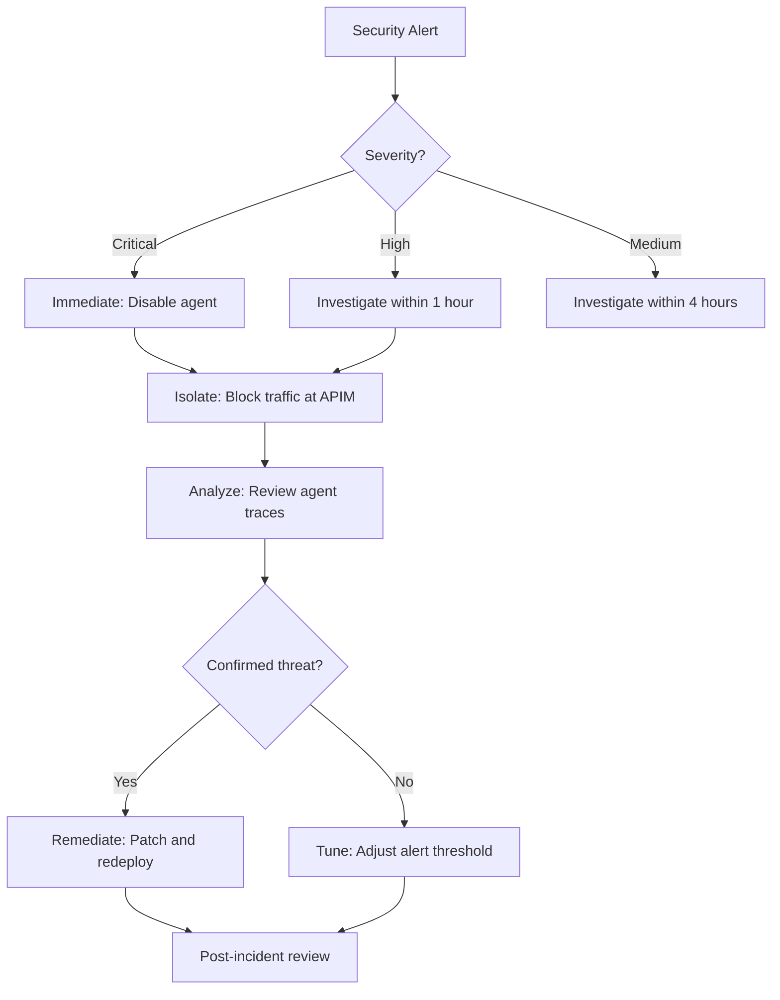

# Chapter 16 — Secure with Microsoft Defender

## Objective

Enable **Microsoft Defender for AI** to provide continuous security monitoring across your Internet of Agents platform — including agent inventory, risk assessment, threat detection, and incident response.

---

## Architecture Context: Enterprise Security Operations for AI

### Where This Fits

Microsoft Defender for AI extends your existing **Security Operations Center (SOC)** to cover AI-specific threats. While Content Safety (Chapter 15) protects at the application level, Defender operates at the **infrastructure level** — detecting threats across the entire agent ecosystem.

### What You Will Achieve

- **Automatic agent inventory** — Defender discovers all AI agents across your Azure subscriptions
- **Risk scoring** — Each agent assessed for data access, tool permissions, and network exposure
- **Active threat detection** — Monitoring for prompt injection, data exfiltration, and anomalous behavior
- **SOC integration** — AI incidents surface in Microsoft Sentinel alongside traditional security alerts

### Benefits of This Approach

| Benefit | Description |
|---------|-------------|
| **Complete Visibility** | Automatic discovery means no "shadow agents" operating without security oversight |
| **AI-Specific Detection** | Purpose-built detectors for prompt injection, jailbreaks, and agent manipulation |
| **Unified SOC** | AI security incidents handled through the same workflows as traditional threats |
| **Attack Path Analysis** | Visualize how attackers could move through the agent mesh to reach sensitive data |
| **Continuous Posture** | Ongoing assessment — not just point-in-time audits |

---

## Prerequisites

- Chapters 01-14 completed
- Microsoft Defender for Cloud enabled on the subscription
- Security Administrator role

---

## Part 1: Understanding Defender for AI

### What Is Microsoft Defender for AI?

Microsoft Defender for AI extends Defender for Cloud to provide security posture management and threat protection specifically for AI workloads:

| Capability | Description |
|-----------|-------------|
| **AI Agent Inventory** | Automatic discovery and cataloging of all AI agents across your organization |
| **Risk Assessment** | Identifies vulnerabilities in agent configurations (exposed endpoints, missing auth, etc.) |
| **Threat Detection** | Real-time alerts for prompt injection, data exfiltration attempts, jailbreaks |
| **Attack Path Analysis** | Maps potential attack paths through your agent ecosystem |
| **Incident Response** | Integrated response workflows for AI-specific security incidents |

### Threat Categories

| Threat | Description | Detection Method |
|--------|-------------|-----------------|
| **Prompt Injection** | Malicious instructions embedded in user input or tool output | Pattern analysis + ML classifier |
| **Data Exfiltration** | Agent tricked into leaking sensitive data | Output content analysis |
| **Jailbreak** | Attempts to override agent system instructions | Behavioral anomaly detection |
| **Unauthorized Tool Use** | Agent calling tools outside its authorized scope | Policy violation alerts |
| **Token Abuse** | Excessive token consumption indicating abuse | Usage anomaly detection |

---

## Part 2: Enable Defender for AI

### Step 1: Enable the Defender Plan

```bash
# Enable Defender for AI on your subscription
az security pricing create \
  --name "AI" \
  --tier "Standard"

# Verify it's enabled
az security pricing show \
  --name "AI" \
  --query '{name: name, tier: pricingTier, freeTrialDays: freeTrialRemainingTime}' \
  -o table
```

### Step 2: Enable on the Foundry Resource

```bash
# Enable Defender on the Foundry AI Services account
FOUNDRY_ID=$(az cognitiveservices account show \
  --resource-group $RESOURCE_GROUP \
  --name $FOUNDRY_NAME \
  --query id -o tsv)

# Defender auto-discovers AI resources when the plan is enabled
# Verify the Foundry resource is being monitored
az security assessment list \
  --query "[?contains(resourceDetails.source, 'AI')]" \
  -o table
```

### Step 3: Configure Security Contacts

```bash
# Set up security contact for AI alerts
az security contact create \
  --name "default" \
  --email "security-team@contoso.com" \
  --alert-notifications "On" \
  --alerts-to-admins "On"
```

---

## Part 3: AI Agent Inventory

### Automatic Discovery

Defender for AI automatically discovers:
- Foundry agents (Prompt and Hosted)
- Azure Functions agents
- App Service-hosted agents
- API Management-managed AI endpoints

### View the Inventory

1. Navigate to **Microsoft Defender for Cloud** → **Workload Protections** → **AI Security**
2. Select **AI Resource Inventory**
3. Review discovered assets:

| Agent | Type | Location | Risk Level |
|-------|------|----------|------------|
| EnterprisePolicyAdvisor | Prompt Agent | Foundry (BYO VNet) | Low |
| EnterpriseTravelAgentHosted | Hosted Agent | Foundry (BYO VNet) | Low |
| EnterpriseTravelAgent | A2A Agent | App Service (VNet) | Medium |
| expense-reviewer | Serverless | Azure Functions (VNet) | Low |
| Travel Advisor | Custom Engine | Teams + App Service | Medium |

### Risk Assessment Details

For each agent, Defender provides:
- **Authentication method**: Managed Identity, API Key, None
- **Network exposure**: Private, VNet-integrated, Public
- **Content filtering**: Enabled/Disabled
- **Tool access scope**: List of accessible tools and data sources
- **Model version**: Whether using latest patched version

---

## Part 4: Configure Threat Detection

### Step 1: Enable AI-Specific Alerts

```bash
# Verify AI threat detection rules are active
az security alert list \
  --query "[?contains(alertType, 'AI_')]" \
  -o table
```

### Step 2: Key Alert Types

| Alert Type | Severity | Description |
|-----------|----------|-------------|
| `AI_PromptInjection` | High | Detected prompt injection attempt in user input |
| `AI_JailbreakAttempt` | High | Detected jailbreak attempt against an agent |
| `AI_DataExfiltration` | Critical | Agent may be leaking sensitive data |
| `AI_UnauthorizedToolAccess` | Medium | Agent attempted to use a non-authorized tool |
| `AI_AnomalousTokenUsage` | Medium | Unusual token consumption pattern |
| `AI_SuspiciousAgentBehavior` | High | Agent behavior deviates from baseline |

### Step 3: Create Custom Alert Rules

```bash
# Create a custom alert for excessive agent token usage
az monitor metrics alert create \
  --resource-group $RESOURCE_GROUP \
  --name "ai-token-abuse-alert" \
  --scopes $FOUNDRY_ID \
  --condition "total TokenTransaction > 100000" \
  --window-size 1h \
  --evaluation-frequency 15m \
  --action-group "ag-security-team" \
  --description "Alert when total token usage exceeds 100K in 1 hour"
```

---

## Part 5: Security Recommendations

### Review Defender Recommendations

Defender for AI provides specific recommendations:

1. **Enable content filtering on all model deployments**
   ```bash
   # Apply content filtering
   az cognitiveservices account deployment update \
     --resource-group $RESOURCE_GROUP \
     --name $FOUNDRY_NAME \
     --deployment-name "gpt-4o" \
     --content-filter "DefaultV2"
   ```

2. **Restrict network access to AI resources**
   - Already configured with BYO VNet ✅

3. **Enable diagnostic logging on all AI endpoints**
   ```bash
   az monitor diagnostic-settings create \
     --resource $FOUNDRY_ID \
     --name "foundry-diagnostics" \
     --workspace $WORKSPACE_ID \
     --logs '[{"category": "Audit", "enabled": true}, {"category": "RequestResponse", "enabled": true}]' \
     --metrics '[{"category": "AllMetrics", "enabled": true}]'
   ```

4. **Use managed identities instead of API keys**
   - Already configured ✅

5. **Enable RBAC on AI resources**
   ```bash
   # Verify RBAC is enforced (no API key access)
   az cognitiveservices account update \
     --resource-group $RESOURCE_GROUP \
     --name $FOUNDRY_NAME \
     --disable-local-auth true
   ```

---

## Part 6: Incident Response Playbook

### When a Security Alert Fires



### Emergency Agent Isolation

If a critical alert fires, immediately isolate the affected agent:

```bash
# Block all traffic to a specific agent at APIM level
az apim product api remove \
  --resource-group $RESOURCE_GROUP \
  --service-name "apim-agents-gateway" \
  --product-id "agent-access" \
  --api-id "compromised-agent-api"

# Or disable the agent in Foundry
# This stops all new requests while preserving the configuration
```

### Audit Trail Query

```kql
// Investigation query: all actions by a specific agent in the last 24 hours
union customEvents, requests, dependencies
| where timestamp > ago(24h)
| where customDimensions["agent.name"] == "SuspiciousAgentName"
| project
    timestamp,
    operation_Name,
    customDimensions,
    success,
    resultCode,
    duration
| order by timestamp desc
| take 100
```

---

## Part 7: Continuous Security Posture

### Weekly Security Review Checklist

- [ ] Review Defender for AI security score
- [ ] Check for new security recommendations
- [ ] Review agent inventory for unauthorized deployments
- [ ] Analyze alert trends (false positive rate)
- [ ] Verify content filtering is active on all deployments
- [ ] Check that API key authentication remains disabled
- [ ] Review RBAC assignments for least-privilege compliance
- [ ] Run red team evaluation (Chapter 15)

---

## Summary

| Component | Status |
|-----------|--------|
| Defender for AI plan enabled | ✅ |
| AI agent inventory discovered | ✅ |
| Threat detection alerts configured | ✅ |
| Custom token abuse alerts | ✅ |
| Content filtering on all deployments | ✅ |
| Diagnostic logging enabled | ✅ |
| Incident response playbook documented | ✅ |
| Local auth disabled (RBAC only) | ✅ |

---

## References

- [Microsoft Defender for AI Overview](https://learn.microsoft.com/en-us/defender-xdr/security-for-ai-overview)
- [Defender for Cloud AI Security](https://learn.microsoft.com/en-us/azure/defender-for-cloud/ai-threat-protection)
- [AI Threat Detection Alerts](https://learn.microsoft.com/en-us/defender-xdr/alerts-ai-threats)
- [Security Best Practices for AI](https://learn.microsoft.com/en-us/azure/ai-services/security-baseline)

---

## Next Steps

Proceed to [Chapter 17 — Capstone: End-to-End Developer Journey](./17-developer-journey.md)
